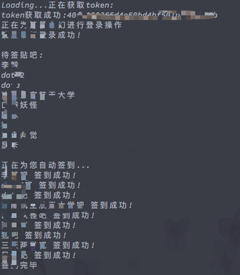

# qq群 百度贴吧 自动签到

## 环境
- linux(centos 7.4)
- php(7.2)
- python(2.7.5)
- beautifulSoup
- selenium(3.11.0)
- firefox(linux 56.0.2)
- xorg-x11-server-Xvfb(linux)

### 百度贴吧自动签到使用说明
启动文件名：`sign.py`
0. 安装 `beautifulSoup`
1. 修改19行 user = '百度账号'
2. 修改20行 password = '百度密码'
3. crontab 设置您想要签到的时间

### qq群自动签到使用说明
启动文件名: `sign.sh`
0. 首先安装 `selenium, firefox, xorg-x11-server-Xvfb`
  如果想设置开机自启动 Xvfb 在 `/etc/rc.local`中部署以下代码：
`/usr/bin/Xvfb :6666 -screen 0 1024x768x24 &
  export DISPLAY=:6666`
1. 修改 `sign.sh` 文件 第10行， 路径更改为您文件的位置。
2. 修改 `getSkey.py` 文件 第11行 输入您的qq号， 第13行 输入您的qq密码。 注意 18行 24行 文件路径位置也要修改。
3. 修改 `qqQun.php` 第7行 $uin 应该为 'o0QQ号'. 87行poi为签到的地理位置 随便修改。 text 为您想要说的话。
4. crontab 设置您想要签到的时间

### 结果如下图

